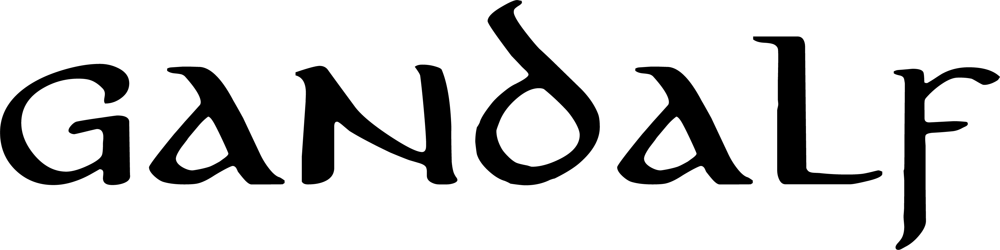
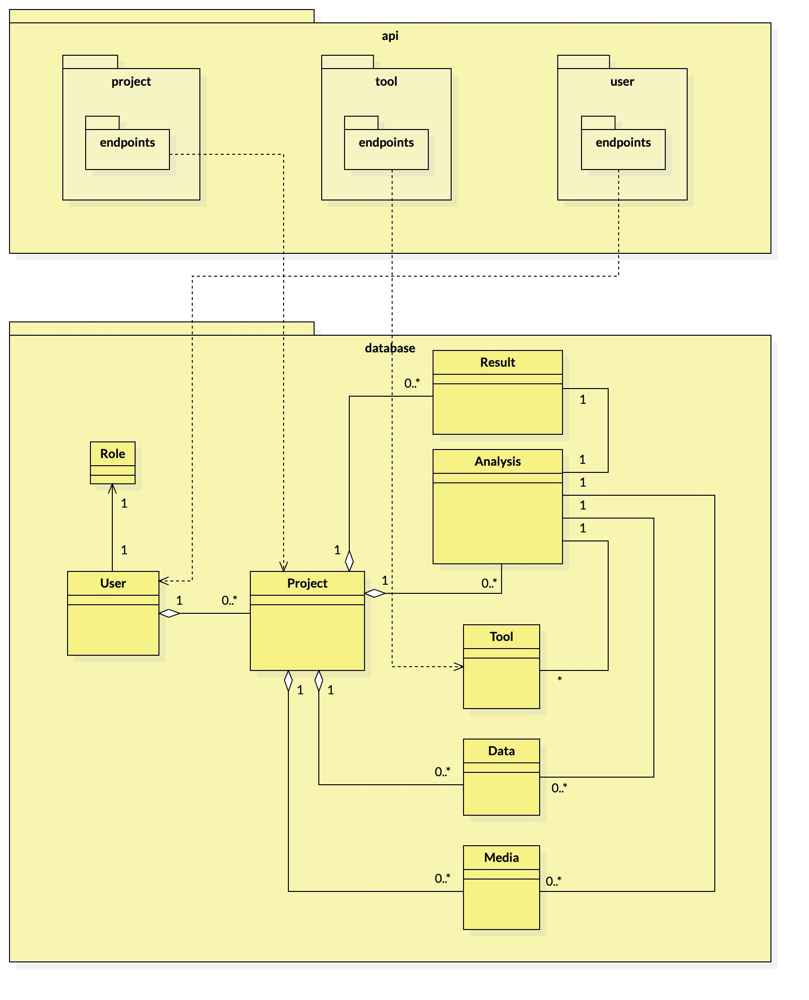

# Gandalf - Multimedia Analysis API

Gandalf è un progetto opensource per l'implementazione di un API Gateway secondo il paradigma RESTful per l'integrazione di strumenti per l'analisi forense tramite endpoint definiti secondo 
le specifiche OpenAPI, promosso dal **Laboratorio di Elaborazione Segnali  & Comunicazioni** ([**LESC**](https://lesc.dinfo.unifi.it/it)).
Il progetto nasce all'interno dell'esame di Elaborazione E Protezione di Immagini tenuto dal Prof. Alessandro Piva per il corso di Laurea Magistrale in Ingegneria Informatica dell'Università di Firenze.

Docs
----------

La definizione di specifiche in sede analisi requisiti, ha generato i seguenti artefatti documentali a supporto del codice sorgente:

1) Il file `docs/gandalf.mdj` di [StarUML](https://staruml.io/) contiene domain model, use case diagram e package diagram. Per comodità sono state esportati i diagrammi anche in formato JPG.
2) Nel file `docs/gandalf.yaml` sono presenti le specifiche OpenAPI originali.
3) Al seguente link invece ([Gandalf](https://www.overleaf.com/read/kmzwgwkschkc)) è possibile visualizzare il report a supporto didascalico del progetto, sviluppato tramite l'editor LateX [Overleaf](https://www.overleaf.com/).

Nell'immagine sottostante una visione globale dell'architettura del progetto, tramite Package Diagram.

Sono stati progettati due layer, identificati dai pricipali package quali: **api** e **database**. Il package api implementa il layer che espone **servizi RESTful** definiti secondo le specifiche OpenAPI; delegano 
la responsabilità di implementare la loro business logic tramite script chiamati "business.py". Il package database implementa il layer della **persistenza dei dati**, utilizzando
un ORM (SQLAlchemy). Per lo sviluppo agile si è utilizzato un database di tipo SQLite.

Installazione
----------

Per installare le dipendenze necessarie per poter eseguire il progetto, tramite terminale spostarsi nella root directory del progetto ed eseguire:

    sh install.sh
    
Questo script avvia una pipeline per l'installazione in sequenza di: un python virtualenv, attivazione virtualenv e installazione requirements.
La scelta di utilizzare un **virtualenv** permette di installare interprete python  e dipendenze localmente senza interferire con le dipendenze globali eventualmente già presenti
nella macchina in cui si sta correntemente installando il progetto. Ciò permette di rendere indipendenti gli enviroment di sviluppo e una migliore
gestione delle dipendenze.
    
    
Dev Mode
----------

Eseguire:

    sh serve.sh
    
Lo script avvierà l'applicazione in modalità sviluppo, rendendola disponibile sotto `localhost:8888`. Tramite la url `localhost:8888/api` è possibile visualizzare la pagina che raccoglie la documentazione OpenAPI generata.

Links
-----

* Flask: https://palletsprojects.com/p/flask/
* Flask-RestPlus: https://flask-restplus.readthedocs.io/en/stable/

Author
-----

* Lorenzo Vannucchi

