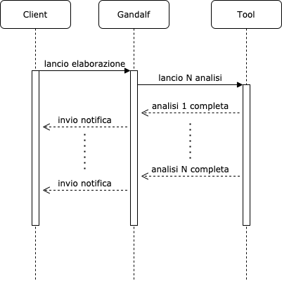

# Gandalf - Multimedia Analysis API

Gandalf è un progetto opensource per l'implementazione di un API Gateway secondo il paradigma RESTful per l'integrazione di strumenti per l'analisi forense tramite endpoint definiti secondo 
le specifiche OpenAPI, promosso dal **Laboratorio di Elaborazione Segnali  & Comunicazioni** ([**LESC**](https://lesc.dinfo.unifi.it/it)).
Il progetto nasce all'interno dell'esame di Elaborazione E Protezione di Immagini tenuto dal Prof. Alessandro Piva per il corso di Laurea Magistrale in Ingegneria Informatica dell'Università di Firenze.

Docs
----------

La definizione di specifiche in sede analisi requisiti, ha generato i seguenti artefatti documentali a supporto del codice sorgente:

1) Il file `docs/gandalf.mdj` di [StarUML](https://staruml.io/) contiene domain model, use case diagram e package diagram. Per comodità sono state esportati i diagrammi anche in formato JPG.
2) Nel file `docs/gandalf.yaml` sono presenti le specifiche OpenAPI originali.
3) Al seguente link invece ([Gandalf](https://www.overleaf.com/read/kmzwgwkschkc)) è possibile visualizzare il report a supporto didascalico del progetto, sviluppato tramite l'editor LateX [Overleaf](https://www.overleaf.com/).

Nell'immagine sottostante una visione globale dell'architettura del progetto, tramite Package Diagram.

Sono stati progettati due layer, identificati dai pricipali package quali: **api** e **database**. Il package api implementa il layer che espone **servizi RESTful** definiti secondo le specifiche OpenAPI; delegano 
la responsabilità di implementare la loro business logic tramite script chiamati "business.py". Il package database implementa il layer della **persistenza dei dati**, utilizzando
un ORM (SQLAlchemy). Per lo sviluppo agile si è utilizzato un database di tipo SQLite.

A livello di implementazione generale, ogni servizio REST fa riferimento ai package project, token, tool e user contenuti nel package **api**. L'impianto generale di progettazione
è stato fatto ispirato dai metodi di sviluppo comunemente utilizzati in ambito Java (bibartizione in lato persistenza e lato servizi) a causa del background di conoscenze di chi ha sviluppato il progetto; così come i file con la definizione dei metodi
che si occupan di implementare la business logic dei servizi. Per ogni servizio abbiamo i file **business.py, dao.py e serializers.py**. Il business.py si occupa di implementaere la logica delle funzionalità
servendosi di metodi in stile "data access object" (dao) per comunicare con il lato di persistenza; mentre **serializers.py** è servito per le politiche di marshalling degli oggetto per la comunicazione "on wire".

Il package **gandalf_app/auth** annovera utility function per la gestione della generazione e validazione token JWT. Il codice è stato ispirato ed adattato da esempi trovati nella documentazione 
di Flask e da progetti open presenti nella repository principale di Flask e Flask-RestPlus.

Prerequisiti
----------

Il seguente progetto utilizza **python virtualenv**. Prima di eseguire i comandi successivi, assicurarsi di aver installato python virtualenv per python 3.X altrimenti l'installazione delle dipendeze genererà errore.
In caso contrario eseguire, assicurarsi di avere **pip** installato (**pip3** per python 3.X) ed eseguire:

`pip3 install virtualenv`

Ricapitolando e facendo riferimento anche ai badge riportati nell'header di questa repository github, i **prerequisiti** sono:

* Python 3.X 
* pip
* virtualenv

Installazione
----------

Per installare le dipendenze necessarie per poter eseguire il progetto, tramite terminale spostarsi nella root directory del progetto ed eseguire:

    sh install.sh
    
Questo script avvia una pipeline per l'installazione in sequenza di: un **python virtualenv**, attivazione virtualenv e installazione requirements.
La scelta di utilizzare un **virtualenv** permette di installare interprete python  e dipendenze localmente senza interferire con le dipendenze globali eventualmente già presenti
nella macchina in cui si sta correntemente installando il progetto. Ciò permette di rendere indipendenti gli enviroment di sviluppo e una migliore
gestione delle dipendenze.
    
    
Dev Mode
----------

Eseguire:

    sh app_serve.sh
    
Lo script avvierà l'applicazione in modalità sviluppo, rendendola disponibile sotto dominio `localhost:8888`. Tramite la url `localhost:8888/api/v1` è possibile visualizzare la pagina che raccoglie la documentazione OpenAPI generata.

Attraverso il comando

    sh tool_serve.sh
    
è possibile lanciare un server che incapsula il tool jpegio. Tale tool è stato utilizzato per implementare un esempio di tool esposto tramite servizio REST con con cui Gandalf può interagire.
Tramite Gandalf è possibile lanciare un'analisi per un determinato progetto e tramite un endpoint SSE è possibile monitorare lo stato dell'elaborazione, fornendo un sistema di notifica reactive che aumenta
la user experience.

Test
----------

N.B: i file generati dai test verranno creati nella stessa cartella del progetto, relativi a upload di media e file

Eseguire:

    sh test.sh
    
Lo script avvierà una pipeline per integration test relativi agli endpoint esposti dal servizio. Ogni nome di un metodo di test comincia per **test_**, per convienzione libreria pytest.
Ogni metodo è annotato da un commento che descrive l'intento: i test sono eseguiti tramite libreria **pytest**, fornendo a runtime un'istanza dell'applicazione e generando
un oggetto **client** che si occupa di chiamare i servizi relativi alle funzionalità implementate. Al paragrafo **Test** del documento ([Gandalf](https://www.overleaf.com/read/kmzwgwkschkc)) è possibile accedere ad una descrizione 
più specifica di come sono stati implementati i test di integrazione.

Server Sent Event (Reactive Application)
----------

Per fare una prova per verificare l'interazione con un tool eseguire i seguenti comandi 

Eseguire:

    sh app_serve.sh
    sh tool_serve.sh
    sh create_mock.sh
    
I comandi lanceranno rispettivamente il server Gandalf, un server che incapsula un tool di prova e una serie di chiamate per creare dati di mock.
il comando create_mock.sh termina con il lancio di un'analisi. Collegandosi alla pagina localhost:8888/sse e lanciando poi create_mock.sh è possibile 
visualizzare la modalità **reactive** dell'applicazione: Gandalf lancia un'analisi chiamando il tool esterno, il quale lancia all'interno di un thread il tool 
in modo asincrono, non bloccando l'applicazione. Al termine dell'elaborazione, il server del tool chiamerà Gandalf tramite opportuno endpoint per 
notificare il termine dell'elaborazione. La pagina /sse contiene uno script javascript per una connessione tramite event source, la quale si aggancia ad un 
endpoint che emette eventi Server Sent. In questo modo Gandalf notificherà in modo asincrono al browser il termine dell'elaborazione senza che l'utente 
debba necessariamente fare refresh della pagina per monitorare lo stato dell'analisi lanciata in precedenza.

Settings
----------

Nel caso ci sia la necessità di **modificare alcune variabili d'ambiente**, come directory dove vengono caricati i file o il dominio su cui gira l'applicazione, modificare il file **gandalf_app/settings.pyt**

Links
-----

* Flask: https://palletsprojects.com/p/flask/
* Flask-RestPlus: https://flask-restplus.readthedocs.io/en/stable/
* PyTest: https://docs.pytest.org/en/stable/

Author
-----

* Lorenzo Vannucchi

